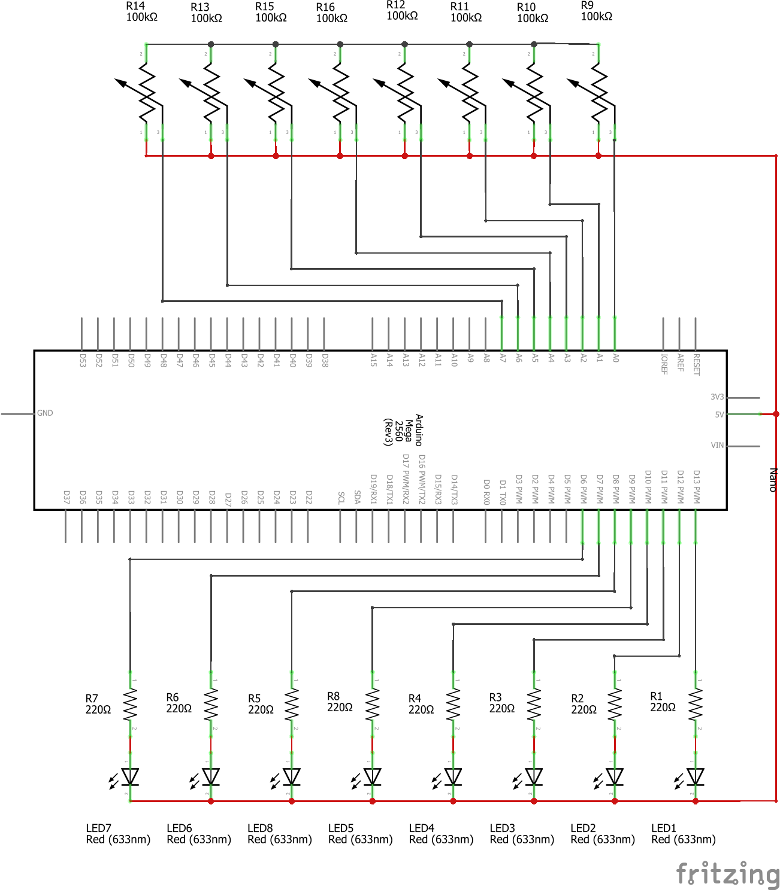
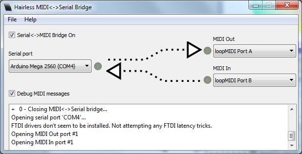

# YAASS
Yet another arduino step sequencer

YASS is a really simple MIDI 8 step sequencer / arpegiator for the Arduino. You can set a note for each step. It also recives MIDI data and transpose the sequence.

The code has been developed using the Mega but it should work in other Arduinos.

## Building

You will nedd a box to put the sequencer, 8 10k linear knobs, 8 leds, 8 220 Ω resistors, and the Arduino. We used the Mega.

To use other pins you can modify the array LedPins and KnobPins on the INO file.

## Libraries

YAAS uses the Arduino MIDI Library. You can find the instructions on how to install it on https://github.com/FortySevenEffects/arduino_midi_library.

## Software needed

YAAS sends MIDI over the serial port using http://projectgus.github.io/hairless-midiserial/.

You may also need to install a virtual MIDI port like https://www.tobias-erichsen.de/software/loopmidi.html to route the MIDI signals.

Hailess MIDI + loopMIDI configuration 

## Playing

Open hairless-MIDI, your DAW of choice, route the loopMIDI Port A to one track and press play.
